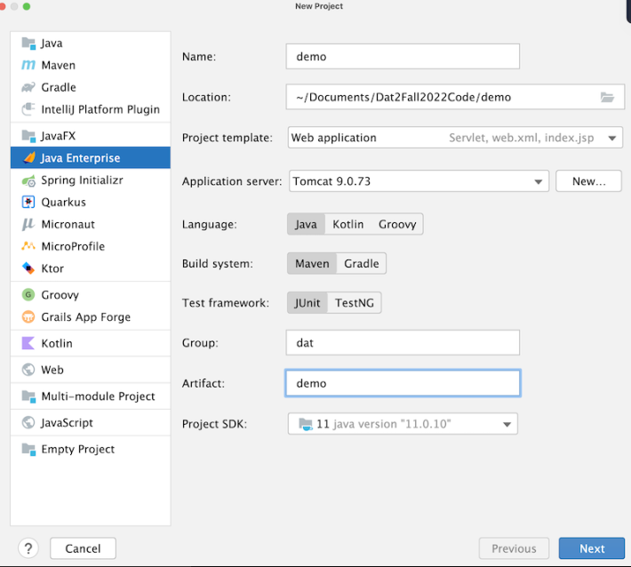

# Dokumentation   (h1 er 1x #) 

Dette er min dokumentation af Java Webstack.
Vi skal lave et intranet og vil bruge denne dokumentation 
til bedre at kunne huske hvad vi lavede undervejs. 
Dokumentationen skal opdateres løbende, så projektet styres bedst muligt undervejs, og så 
onboarding af nye projekt-medarbejdere på Intranet-projektet bliver nemmere.

## Start af et nyt netprojekt (h2 er 2x ## - mindre)

1. Opret et nyt projekt i Intellij kaldet 'Intranet'
2. Vælg JavaEE projektskabelon
3. Java + Maven vælges i indstillingerne
4. Servlet dependencies (bla. web-application + TomCat findes i stifinder - sikr use)
5. Artifact kaldes 'dat'
6. 

### Arkitektur (h3 er 3x ### - endnu mindre)

Vi anvender en slags MVC-pattern:
- M - Model - modellen er vores entities og hjælpe- metoder & klasser. Forretningslogik.
- V - View - view er JSP og frontend (css, bootstrap mm)
- C - Control - Servlets (snakker med databasen)

(OBS Model + View må ALDRIG snakke sammen uden en Servlet - det går altid igennem Controlleren, som set på billedet under:)

